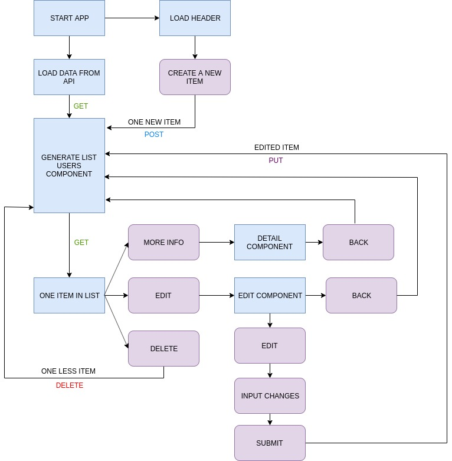

# Crud Exercise in Angular

This project was generated with [Angular CLI](https://github.com/angular/angular-cli) version 8.3.15.

##  👩‍🔧️ How to start

Clone online repository from [this link](https://github.com/EvaMarco/basic_CRUD_angular).

Then install all dependences by running `npm install`.

## 👣️ 👣️ Step by step

1. Create basic components structure idea. 
   
   - 

2. Create angular basic app using angular cli. `ng new angular7-crud-exercise`.
3. Create diferent components we are going to need. 
   1. `ng g c user-list`
   2. ` ng g c user-detail`
   3. `ng g c user-add`
   4. `ng g c user-edit`
   5. `ng g c user-delete`
4. Create basic user object.
5. Create routes arrays in `app-routing.module.ts`
6. Add router tag in app.component.html.
7. Create Service of Api Rest `ng g service api`. And Create all functions
   1. Create `getUserList` function.
   2. Create `getUserById` function.
   3. Create `createUser` function.
   4. Create `updateUser` function.
   5. Create `deleteUser` function.   
8. Create api endpoint.
9.  Check getUsers component get the data, and represent it in screen.
10. Create diferents route paths to each component in `app-routing.module.ts`
11. Create a message service to inform of each step to the user. 
12. Manage Detail component, change route when you press More button in list.
13. Manage Edit component, change route when you press Edit Button. 
14. Manage New user component, change route when you press New User button. 
15. Delete item of list and reload ui when you press delete button. 
16. When routing and functions works, add styles to each component. 
17. Create diferent media queries to get a responsive desing. 

## Development server

Run `ng serve` for a dev server. Navigate to `http://localhost:4200/`. The app will automatically reload if you change any of the source files.

## Code scaffolding

Run `ng generate component component-name` to generate a new component. You can also use `ng generate directive|pipe|service|class|guard|interface|enum|module`.

## Build

Run `ng build` to build the project. The build artifacts will be stored in the `dist/` directory. Use the `--prod` flag for a production build.

## Running unit tests

Run `ng test` to execute the unit tests via [Karma](https://karma-runner.github.io).

## Running end-to-end tests

Run `ng e2e` to execute the end-to-end tests via [Protractor](http://www.protractortest.org/).

## Further help

To get more help on the Angular CLI use `ng help` or go check out the [Angular CLI README](https://github.com/angular/angular-cli/blob/master/README.md).

## Disclaimer
  This was my first time creating an Angular app, and my first time using typescript. 
